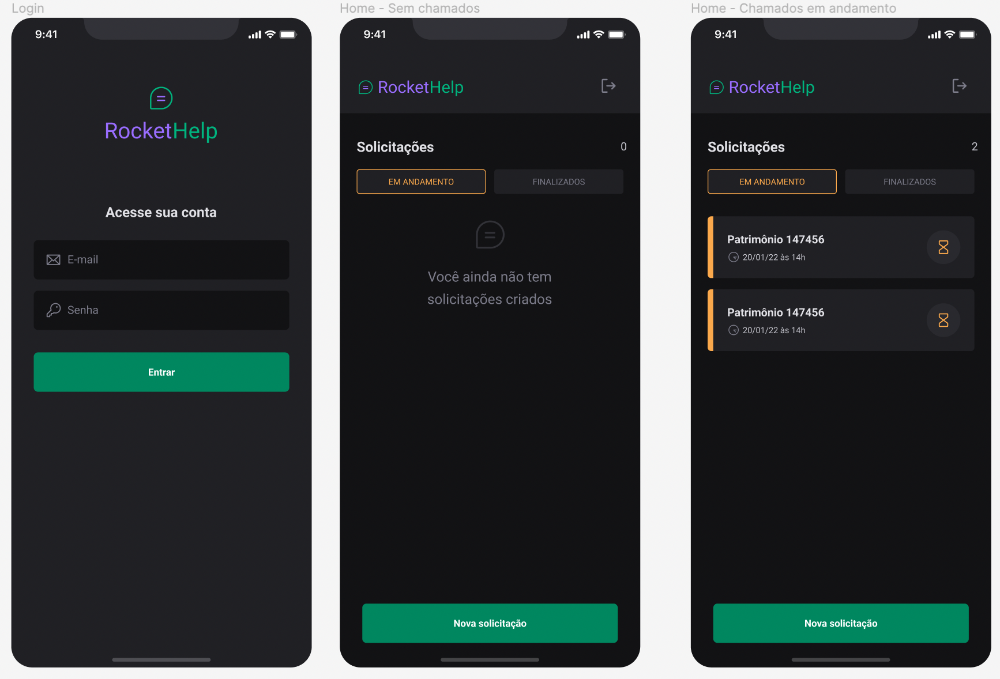
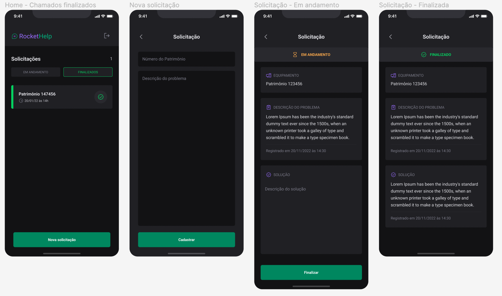

## 🚀 Sobre o Projeto
A ideia do projeto foi para aplicar, práticar e melhorar minhas habilidades técnicas em desenvolvimento mobile.

## 🚀 Novas versões
Conforme vou adquirindo novas habilidades, irei atualizando o projeto em novas versões. 

## 🚀 Tecnologias utilizadas
- React Native
- Native Base
- Firebase
##

    
    
    

